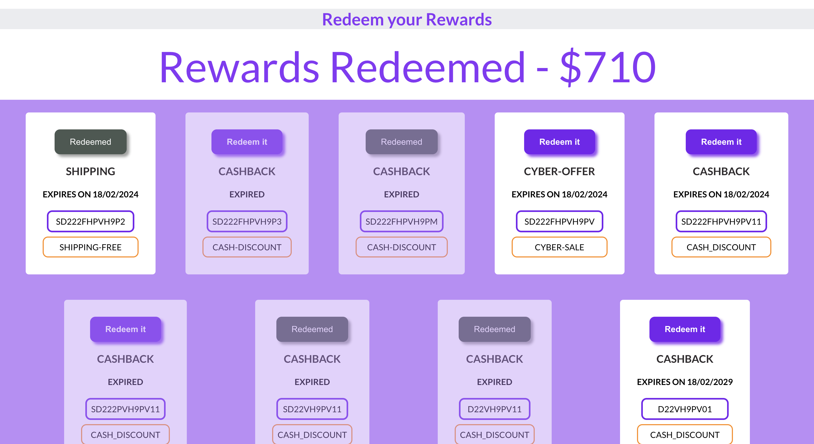

# Rewards Page

The page shows the list from reward coupons of the user. These coupons are fetched from backend server.
It shows which coupons are expired, which are ready to redeemed and which are already redeemed by user.

     

## To run project locally - 

In the project directory, you can run:

### `npm start`

Runs the app in the development mode.\
Open [http://localhost:3000](http://localhost:3000) to view it in your browser.

The page will reload when you make changes.\
You may also see any lint errors in the console.
